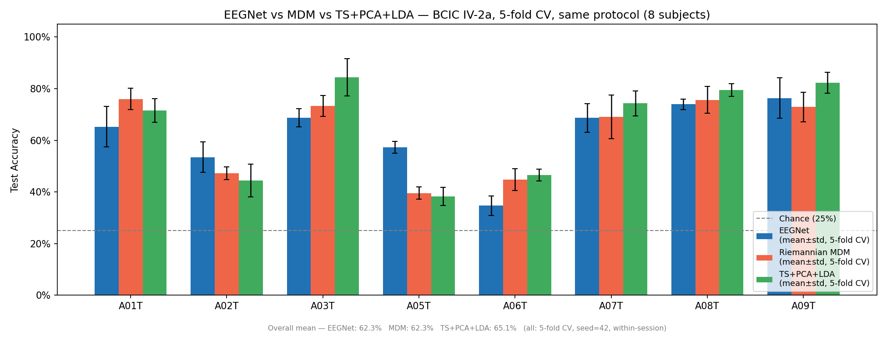

# Multi-Branch EEGNet for Motor Imagery (BCIC IV-2a)

This project explores robust EEG decoding for brain-computer interfaces using a multi-branch EEGNet architecture and large-scale multi-subject evaluation.

This repository implements a multi-branch EEGNet-style deep learning pipeline for 4-class motor imagery EEG decoding using **PyTorch** and **MNE**.

The model uses two temporal convolution branches with long and short kernels, independent spatial projections across electrodes, and fused feature representations before classification.

The goal of this project is to study EEG decoding performance across multiple subjects using the **BCI Competition IV-2a dataset**.

---

# Overview

Motor imagery classification from EEG signals is a central problem in **brain-computer interface (BCI)** research. EEG signals are highly variable across subjects and sessions, which makes reliable decoding difficult.

This repository provides a **reproducible deep learning pipeline** for running multi-subject EEG decoding experiments using a modified EEGNet architecture.

---

# Model Features

- Multi-branch EEGNet-style architecture  
- Two temporal convolution branches with long and short kernels  
- Independent spatial filtering across electrodes  
- Feature fusion before classification  
- Implemented using **PyTorch** and **MNE**

---

# What This Repository Does

- Runs **within-session evaluation** for each subject file (`AxxT.gdf`)
- Supports **multi-subject and multi-seed experiment sweeps**
- Uses **sliding-window test-time voting**
- Saves per-run logs and evaluation metrics
- Writes experiment summaries to `summary.csv` and `summary.json`
- Includes label-shuffle sanity checks to confirm models are not exploiting dataset artifacts

---

# Dataset

This project uses the **BCI Competition IV-2a dataset**.

The GDF files are **not included** in this repository. Download the dataset separately from **PhysioNet** or the original **BCI Competition website**.

---

# Excluded Subjects

Subject **A04T** is excluded from all reported results due to a known EOG channel
recording inconsistency that affects epoch quality in a way that cannot be corrected
uniformly in post-processing. This exclusion is applied identically across all methods
(EEGNet, MDM, TS+PCA+LDA) to ensure fair comparison.

All other 8 subjects (A01T–A03T, A05T–A09T) are included.

---

# Environment Setup

Create the conda environment:

```bash
conda env create -f environment.yml
conda activate neuro
```

Set the dataset directory:

```bash
export BCICIV2A_DIR=/path/to/BCICIV_2a_gdf
```

---

# Run

Run the main experiment script:

```bash
python scripts/eegnet7_multisubject.py
```

---

# Outputs

Example run outputs:

```
runs/eegnet7_A01T_seed42_YYYYmmdd_HHMMSS/
├── best.pth
├── metrics.json
├── confusion_matrix.txt
├── classification_report.txt
└── train.log
```

Aggregate results are written to:

```
runs/summary.csv
runs/summary.json
```

---

# Results

The primary evaluation ran a full **multi-subject experiment sweep** across the BCIC IV-2a dataset.

**Experiment setup**

- 8 subjects (A01, A02, A03, A05, A06, A07, A08, A09)
- 5 random seeds per subject
- **40 runs total**

Across all runs, the model achieved:

**70.5% ± 14.7% mean test accuracy**

Some subjects consistently reached **80–90% accuracy**, while others proved significantly harder to decode. This variability reflects the well-known challenge of **EEG heterogeneity across individuals**.

### Per-Subject Performance


---

# Example Confusion Matrix

The confusion matrix below shows the best-performing run (Subject A07, seed 44).


The model correctly separates the four motor imagery classes:

- Left hand
- Right hand
- Foot
- Tongue

---

# Cross-Session Evaluation

To study **session drift**, the model was trained on the BCIC IV-2a training session (`AxxT`) and evaluated on the separate evaluation session (`AxxE`).

Across 8 subjects and 5 random seeds per subject, average performance dropped from about **79% within-session accuracy** to about **70% cross-session accuracy**.

This drop was **not uniform across subjects**. Some subjects transferred relatively well across sessions, while others showed larger degradation.

Example subject-level averages:

| Subject | Within-Session Accuracy | Cross-Session Accuracy |
|--------|-------------------------|------------------------|
| A03 | 93% | 84% |
| A07 | 92% | 76% |
| A05 | 79% | 63% |
| A02 | 58% | 50% |

### Within-Session vs Cross-Session Performance

The figure below highlights the effect of **session drift** across subjects.


These results highlight a central challenge in EEG-based brain-computer interfaces: **session-to-session distribution shift**. Even when the same subject performs the same motor imagery task, signal characteristics can change enough to reduce decoding performance.

This finding shifts the focus beyond benchmark accuracy toward building models that are **robust to non-stationary neural signals**.

---

# Baseline Comparisons

To contextualise EEGNet performance, two classical Riemannian geometry baselines were
evaluated on the same 8 subjects using **pyRiemann**:

- **MDM** (Minimum Distance to Mean): classifies epochs by their distance to the
  per-class mean covariance matrix on the Riemannian manifold.
- **TS+PCA+LDA**: projects covariance matrices to the tangent space, reduces
  dimensionality with PCA (95% variance retained), then applies Linear Discriminant
  Analysis.

Both pipelines use OAS-regularised covariance estimation and 8–30 Hz bandpass
filtering over a 0.5–2.5 s post-cue window.

All three methods are evaluated under the **same protocol**: 5-fold stratified
cross-validation, within-session (AxxT files), seed=42. EEGNet was run on the
Palmetto GPU cluster; Riemannian pipelines on local CPU.

### Per-Subject Accuracy



| Subject | EEGNet     | MDM    | TS+PCA+LDA |
|---------|------------|--------|------------|
| A01T    | 65%        | 76%    | 72%        |
| A02T    | 54%        | 47%    | 44%        |
| A03T    | 69%        | 73%    | 84%        |
| A05T    | 57%        | 40%    | 38%        |
| A06T    | 35%        | 45%    | 47%        |
| A07T    | 69%        | 69%    | 74%        |
| A08T    | 74%        | 76%    | 80%        |
| A09T    | 76%        | 73%    | 82%        |
| **Mean**| **62%**    | **62%**| **65%**    |

Under identical evaluation conditions, EEGNet and MDM are essentially tied at
**62%**, with TS+PCA+LDA leading at **65%**. EEGNet's previously reported higher
figures reflected a more favourable holdout-split protocol rather than a genuine
performance advantage.

No single method dominates across all subjects. EEGNet has a clear edge on
**A05T** (57% vs both Riemannian methods near chance) — consistent with that
subject's motor imagery being encoded in temporal features rather than covariance
structure. Riemannian methods lead on **A01T**, **A03T**, and **A06T**, while
**A09T** is the strongest subject for all three methods.

The full analysis scripts are in `scripts/riemannian_baseline.py`,
`scripts/compare_methods.py`, and `scripts/investigate_a05t.py`.

---

# Future Directions

- **Combined features**: investigate whether concatenating EEGNet embeddings with
  tangent-space features improves over either method alone.
- **A09T investigation**: TS+PCA+LDA outperforms EEGNet by 17 points on A09T.
  Understanding whether this reflects stronger covariance structure, weaker temporal
  features, or a train/test split artefact would inform future architecture choices.
- **Cross-subject transfer learning**: the subject-level variance is large enough
  that subject-independent models remain an open problem on this dataset.
- **Domain adaptation**: session drift is documented in the cross-session results;
  Riemannian recentering (e.g. Euclidean alignment) is a natural next step.

---

# Repo Structure

```
figures/
    per_subject_accuracy.png
    confusion_matrix_best.png
    cross_session_comparison.png
    method_comparison.png

scripts/
    eegnet7_multisubject.py
    eegnet7_cross_session.py
    riemannian_baseline.py
    compare_methods.py
    investigate_a05t.py
    run_eegnet_seed42.py

results/
    riemannian_results.json
    riemannian_summary.csv

environment.yml
README.md
```

---

# Final Note

This repository focuses on **reproducible EEG decoding experiments**, emphasizing **multi-subject evaluation and cross-session robustness**, which are critical challenges in real-world brain-computer interfaces.
